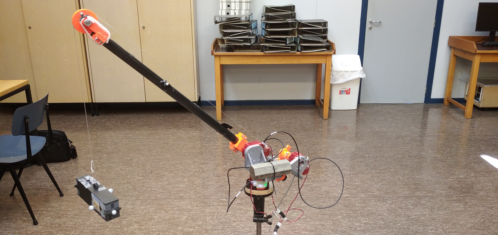

<!-- PROJECT PICTURE -->
 

  
  
<h3 align="center">Identification and validation of the model of an in-scale prototype of a boom crane</h3>
  
  

    MA1 Project
     
     
    <a href="https://github.com/Dinh-Hao-Nguyen/MA1_Project_Crane/blob/main/MA1project_MaximeJongen_Dinh-HaoNguyen.pdf">Link to the report</a>
    ·
    <a href="https://www.youtube.com/shorts/0ZIyQ80FdGc">View demo</a>
  

  

<!-- TABLE OF CONTENTS -->

  
Table of Contents

  <ol>
    <li>
      <a href="#about-the-project">About The Project</a>
      <ul>
        <li><a href="#built-with">Built With</a></li>
      </ul>
    </li>
    <li><a href="#installation">Installation</a></li>
    <li><a href="#description-of-the-matlab-code">Description of the MATLAB code</a></li>
    <li><a href="#contacts">Contacts</a></li>
    <li><a href="#acknowledgments">Acknowledgments</a></li>
  </ol>

<!-- ABOUT THE PROJECT -->
## About The Project

This project was realized within the framework of the Master 1 Project in Electromechanical Engineering at the ULB. The objective is to identify the model of a crane prototype and to validate it experimentally. All MATLAB codes used throughout this project can be found here.

(<a href="#top">back to top</a>)

### Built With

* [MATLAB](https://nl.mathworks.com/products/matlab.html)
* [Simulink](https://nl.mathworks.com/products/simulink.html)

(<a href="#top">back to top</a>)

<!-- GETTING STARTED -->
## Installation

To install the HEBI API for MATLAB, please refer to the [official website of HEBI](https://docs.hebi.us/tools.html#installation).

(<a href="#top">back to top</a>)

<!-- DESCRIPTION OF THE MATLAB CODE -->
## Description of the MATLAB code

(coming soon)

(<a href="#top">back to top</a>)

<!-- CONTACT -->
## Contacts

* Maxime Jongen - maxime.jongen@ulb.be
* Dinh-Hao Nguyen - dinh-hao.nguyen@ulb.be

(<a href="#top">back to top</a>)

<!-- ACKNOWLEDGMENTS -->
## Acknowledgments

* Prof. Emanuele Garone
* Ir. Michele Ambrosino

(<a href="#top">back to top</a>)

